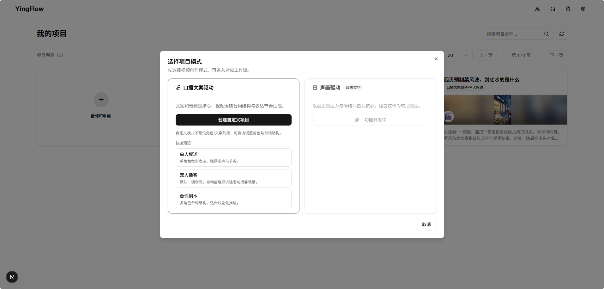
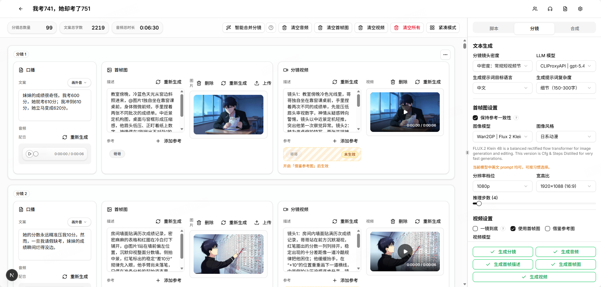
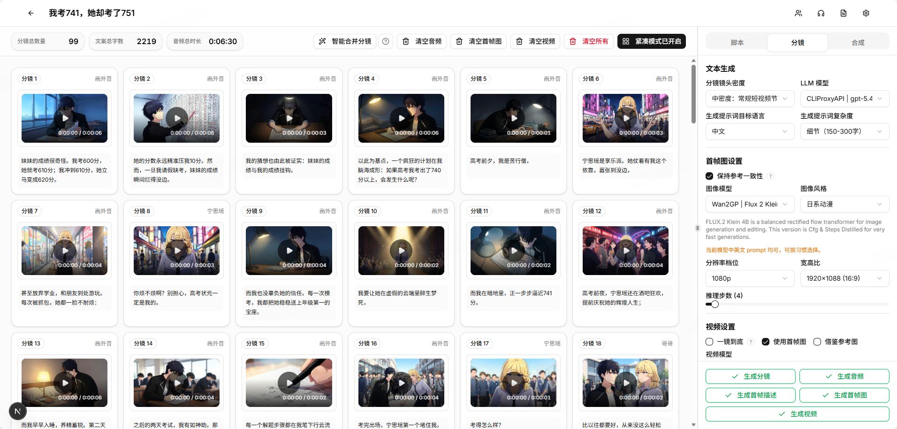

# LocalVideo

<p align="center">
  
</p>

<p align="center">
  <b>An end-to-end iterative AI video pipeline for creators</b>
</p>

<p align="center">
  <a href="./README.md">中文</a> | <a href="./README_EN.md">English</a>
</p>

---

## ✨ Project Highlights

LocalVideo is not just another "generate a video" tool. It is an **iterative creative workspace**.

We believe AI video creation should not be a one-shot prompt gamble. It should be an **industrialized process from idea to final cut**. LocalVideo is built around project-based orchestration: scripts, character settings, voice configuration, and outputs from every stage stay inside one project, so you can rerun, replace, and reuse them instead of starting over every time.

LocalVideo combines familiar video-pipeline capabilities with a few ideas that make it different from many other tools.

### 1. Full Video Pipeline Orchestration

These are the core capabilities most serious video workflows need, and LocalVideo connects them into one continuous pipeline:

*   **Script generation and structured extraction:** Generate scripts automatically and extract structured elements such as characters and scenes.
*   **Shot description generation:** Automatically build detailed storyboard and shot prompts to control pacing and visuals.
*   **Multi-character voice synthesis:** Support multi-character dialogue with customizable voice styles.
*   **Primary video engine + local fallback:** Uses Seedance 2.0 via `kwjm.com` as the default video engine, with automatic fallback to local Wan2GP when the API path is unavailable.
*   **Visual consistency:** Generate stylistically consistent first frames and videos to reduce character drift.
*   **Automated composition:** Render the final video with aligned audio, subtitles, and composition in one flow.

### 2. LocalVideo Highlights (Why LocalVideo?)

*   **A distinct content classification model:** LocalVideo separates creation into **script-driven talking-head workflows** and **audio-visual-driven workflows**. The current version is mainly optimized around script-driven creation, while the overall architecture is already organized around both modes.
*   **End-to-end local model support:** Audio, image, and the local video fallback path can run in GPU environments, making low-cost and privacy-friendly workflows possible.
*   **Connected search and DeepResearch context:** LocalVideo supports web search, DeepResearch, and web-page parsing, then stores the results as reusable project context for later script generation.
*   **External content loop:** Built-in video link parsing and downloading turns third-party video content into editable creative material, enabling a workflow from "external content -> extracted material -> secondary creation".
*   **Project-level asset accumulation:** Reference libraries, voice libraries, and text libraries can be reused across projects, so each project contributes to a growing creative asset base instead of starting from zero.

---

## 🎬 Preview

<details>
<summary>Click to expand UI previews</summary>

### Home


### Shot Editing


### Storyboard

</details>

---

## 🛠️ Quick Start

For most users, **Docker** is the easiest way to try the full workflow.

### Option A: Docker Deployment (Recommended)

```bash
# CPU mode (primarily using the Seedance 2.0 API path)
docker compose --profile cpu up --build

# GPU mode (to enable Wan2GP local generation capability)
docker compose --profile gpu up --build
```

> Endpoints: frontend `http://localhost:3000` | backend `http://localhost:8000`

### Option B: Local Development Environment

**Requirements:** Python 3.11+, Node.js 22+, `uv`, `pnpm`

1. **Backend**
   ```bash
   cd backend
   uv sync && uv run alembic upgrade head
   uv run uvicorn app.main:app --reload --port 8000 # CPU mode
   DEPLOYMENT_PROFILE=gpu uv run uvicorn app.main:app --reload --port 8000 # GPU mode, with Wan2GP configured locally
   ```
2. **Frontend**
   ```bash
   cd frontend
   pnpm install && pnpm dev
   ```

---

## 🧭 Development Loop

This repository follows a mandatory "finish phase -> verify -> commit -> push -> continue" workflow for development, iteration, refactors, and non-trivial fixes.

- Each request should be split into milestone-based phases that match product or functional boundaries.
- After each completed phase, verify it, create one scoped commit, push it to GitHub, and then continue to the next phase.
- Do not collapse multiple milestones into one catch-all commit, and do not stop after planning when the next safe phase is already executable.

Full workflow: [docs/development-workflow.md](./docs/development-workflow.md)

---

## 🧠 Local Models

LocalVideo now uses **Seedance 2.0** as the primary video engine, while **Wan2GP** provides local audio, image, and video fallback capabilities, with local video support up to 1080p output.

Using the Flux 2 Klein 4B + LTX-2 2.3 Distilled 22B combination on an RTX 4070 (12GB), LocalVideo can generate about 60 seconds of 1080P video in roughly 1 hour.

<details>
<summary>Click to expand model list</summary>

### Audio Generation

| Model | Parameter Scale | Voice Capability |
| --- | --- | --- |
| Qwen3 Base (12Hz) | 1.7B | Reference-audio voice cloning |
| Qwen3 Custom Voice (12Hz) | 1.7B | Preset voice timbres |
| Qwen3 Voice Design (12Hz) | 1.7B | Text-described voice design |

### Image Generation

| Model | Parameter Scale | Modes | Inference Steps | Chinese/English Prompt Support |
| --- | --- | --- | --- | --- |
| Flux 1 Dev | 12B | T2I | 30 | English-first, weaker Chinese |
| Flux Schnell | 12B | T2I | 10 | English-first, weaker Chinese |
| Z-Image Turbo | 6B | T2I | 8 | Balanced for Chinese and English |
| Z-Image Base | 6B | T2I | 30 | Balanced for Chinese and English |
| Qwen Image | 20B | T2I | 30 | Strong Chinese, usable English |
| Qwen Image 2512 Release | 20B | T2I | 30 | Strong Chinese, usable English |
| Flux 2 Dev | 32B | T2I / I2I | 30 | English-first, usable Chinese |
| Flux 2 Dev NVFP4 | 32B | T2I / I2I | 30 | English-first, usable Chinese |
| pi-FLUX.2 Dev | 32B | T2I / I2I | 4 | English-first, usable Chinese |
| pi-FLUX.2 Dev NVFP4 | 32B | T2I / I2I | 4 | English-first, usable Chinese |
| Flux 2 Klein | 4B / 9B | T2I / I2I | 4 | Balanced for Chinese and English |
| Flux 2 Klein Base | 4B / 9B | T2I / I2I | 30 | Balanced for Chinese and English |
| Flux Dev Kontext | 12B | I2I | 30 | English-first, weaker Chinese |
| Flux DreamOmni2 | 12B | I2I | 30 | English-first, weaker Chinese |
| Qwen Image Edit | 20B | T2I / I2I | 30 | Strong Chinese, usable English |
| Qwen Image Edit Plus | 20B | T2I / I2I | 30 | Strong Chinese, usable English |
| Qwen Image Edit Plus (2509) | 20B | T2I / I2I | 30 | Strong Chinese, usable English |
| Qwen Image Edit Plus (2509) Nunchaku FP4 | 20B | T2I / I2I | 4 | Strong Chinese, usable English |
| Qwen Image Edit Plus (2511) | 20B | T2I / I2I | 30 | Strong Chinese, usable English |

### Video Generation

| Model | Parameter Scale | Modes | Default FPS | Inference Steps | Chinese/English Prompt Support |
| --- | --- | --- | --- | --- | --- |
| Wan 2.1 | 1.3B / 14B | T2V / I2V | 16 fps | 30 | Balanced for Chinese and English |
| Wan 2.2 | 14B | T2V / I2V | 16 fps | 30 | Balanced for Chinese and English |
| Hunyuan 1.5 720p | 8B | T2V / I2V | 24 fps | 30 | Balanced for Chinese and English |
| Hunyuan 1.5 480p | 8B | T2V / I2V | 24 fps | 30 | Balanced for Chinese and English |
| Fun InP | 1.3B / 14B | I2V | 16 fps | 30 | Balanced for Chinese and English |
| LTX-2 2.3 Dev | 22B | T2V / I2V | 24 fps | 30 | English-first, weaker Chinese |
| LTX-2 2.3 Distilled | 22B | T2V / I2V | 24 fps | 8 | English-first, weaker Chinese |

Note: some Wan2GP video models include `480p` or `720p` in the model name, such as `Hunyuan 1.5 T2V 480p` and `Hunyuan 1.5 T2V 720p`. In practice, those labels are closer to the model's default or native resolution bucket, not a hard output limit. Different models can still behave differently in quality, VRAM usage, and stability across resolutions.

</details>

---

## 🔄 Typical Creative Flow

1. **Create a project:** Choose a template such as single narration, duo podcast, or dialogue script.
2. **Input content:** Import context and generate the script.
3. **Assign characters:** Pick voices and visual references from your asset libraries.
4. **Iterate through stages:** Break the work into storyboard -> audio -> visuals -> video.
5. **Compose and export:** Produce the final subtitled video in one pass.

---

## 🎯 Who Is It For?

*   ✅ **Professional creators:** People producing talking-head videos, podcasts, or short scripted formats who want fine-grained control.
*   ✅ **Local-first users:** People with capable GPUs who want to run a full AI video workflow locally.
*   ✅ **Efficiency-focused creators:** People tired of jumping between multiple AI tools and looking for one unified workspace.

---

## 🙏 Acknowledgements

Part of LocalVideo depends on integrations with great open-source projects. Thanks to the following projects and their contributors:

### Local model capability

- [Wan2GP](https://github.com/deepbeepmeep/Wan2GP)

### Video link parsing and downloading

- [XHS-Downloader](https://github.com/JoeanAmier/XHS-Downloader)
- [TikTokDownloader](https://github.com/JoeanAmier/TikTokDownloader)
- [KS-Downloader](https://github.com/JoeanAmier/KS-Downloader)

### Web link parsing

- [Jina Reader](https://github.com/jina-ai/reader)
- [Crawl4AI](https://github.com/unclecode/crawl4ai)

---

## Star History

<a href="https://www.star-history.com/?repos=XucroYuri%2FLocalVideo&type=date&legend=top-left">
 <picture>
   <source media="(prefers-color-scheme: dark)" srcset="https://api.star-history.com/image?repos=XucroYuri/LocalVideo&type=date&theme=dark&legend=top-left" />
   <source media="(prefers-color-scheme: light)" srcset="https://api.star-history.com/image?repos=XucroYuri/LocalVideo&type=date&legend=top-left" />
   
 </picture>
</a>
